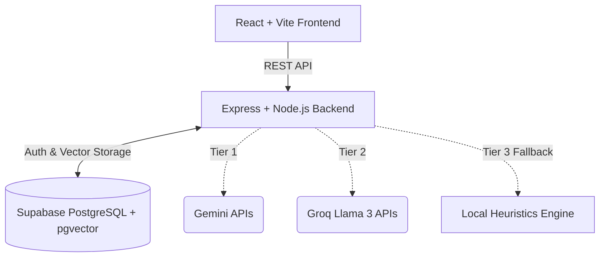

# ContentPulse: Social Media Content Analyzer

ContentPulse is a full-stack, enterprise-grade AI platform designed to mathematically score, analyze, and optimize social media content for maximum engagement across various platforms (LinkedIn, Twitter, Facebook, Instagram). Built with a state-of-the-art resilience architecture, it features a multi-tiered model cascading pipeline, local heuristic fallbacks, and Retrieval-Augmented Generation (RAG) for personalized tone-matching.

## Project Structure and Guidelines Adherence
This repository has been strictly curated according to assignment guidelines:
- Minimal Dependencies: Only essential packages have been included. No extraneous modules are present.
- Clean Codebase: All build artifacts, temporary editor configurations, and environment configuration files containing sensitive keys have been excluded via `.gitignore`.
- Branching Strategy: The main development branch is set to `main`.
- Styling: Built utilizing standard vanilla CSS variables (`index.css`) rather than relying on heavy utility frameworks, ensuring maximum performance and customizability while maintaining a sleek, professional light-mode aesthetic.

## Key Features

1. **Algorithmic Engagement Scoring**
   Calculates an engagement score (0-100) based on platform-specific heuristics including text length, readability index, hashtag density, emotional resonance, and call-to-action clarity.

2. **Tone-Matching via RAG (Retrieval-Augmented Generation)**
   Employs vector embeddings (`pgvector`) and cosine similarity search to ingest a user's past high-performing posts. When rewriting new content, the system retrieves and injects these past posts into the LLM context, ensuring the output perfectly replicates the user's unique phrasing, formatting, and structural style.

3. **Multi-Tier Resilience Pipeline (AI Orchestrator)**
   Guarantees zero-downtime execution using the Circuit Breaker pattern. 
   - Tier 1: Google Gemini Flash (Primary Cloud LLM)
   - Tier 2: Groq Llama 3 API (High-Speed Fallback)
   - Tier 3: Local Heuristics Engine (Keyless Offline Algorithmic Fallback)

4. **Competitor Benchmarking**
   Provides a comparative analysis via radar charts, comparing the user's draft against a competitor's successful post to highlight relative strengths and areas for improvement.

5. **Professional UI/UX**
   A polished, enterprise-ready light user interface featuring neumorphic design elements, optimized contrast metrics, and dynamic micro-animations.

## Architecture



## Technology Stack

- **Frontend:** React 18, Vite, TypeScript, Zustand, Recharts, Lucide Icons.
- **Backend:** Node.js, Express, TypeScript, Zod.
- **AI Integration:** Google Generative AI (`text-embedding-004` and `gemini-flash`), Groq Cloud API.
- **Database:** Supabase (PostgreSQL with `pgvector` extension).

## Setup Instructions

### 1. Repository Initialization
Clone the repository to your local machine:
```bash
git clone <repository-url>
cd <repository-directory>
```

### 2. Dependency Installation
Navigate to both the client and server directories to install the required packages.
```bash
cd client && npm install
cd ../server && npm install
```

### 3. Environment Configuration
Create a `.env` file in the `server` directory. Refer to `.env.example` (if provided) for the required format. Ensure you provide valid Supabase credentials and AI Provider API keys to utilize cloud features.

### 4. Database Migrations
Execute the SQL files located in `supabase/migrations/` within your Supabase SQL Editor. 
- `001_initial_schema.sql`: Initializes tables for profiles, analyses, rewrites, and benchmarks.
- `002_add_pgvector_and_personas.sql`: Enables the vector extension and configures the schema required for the RAG Tone-Matching capabilities.

### 5. Starting the Development Servers
Open two separate terminal instances.

**Terminal 1 (Backend):**
```bash
cd server
npm run dev
```

**Terminal 2 (Frontend):**
```bash
cd client
npm run dev
```

The application will be accessible via your browser at `http://localhost:5173`.

## System Design and Scaling Strategy
A comprehensive analysis of potential scaling bottlenecks (e.g., API rate limits, database connections, and large file parsing) along with architectural solutions (e.g., Redis caching, background job queues, and connection pooling) can be found in the included `scaling_and_pitch_strategy.md` documentation.
